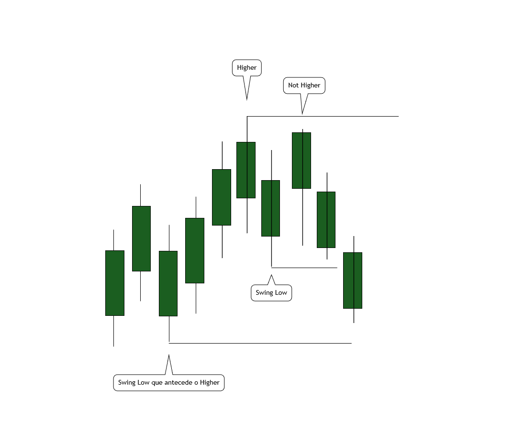
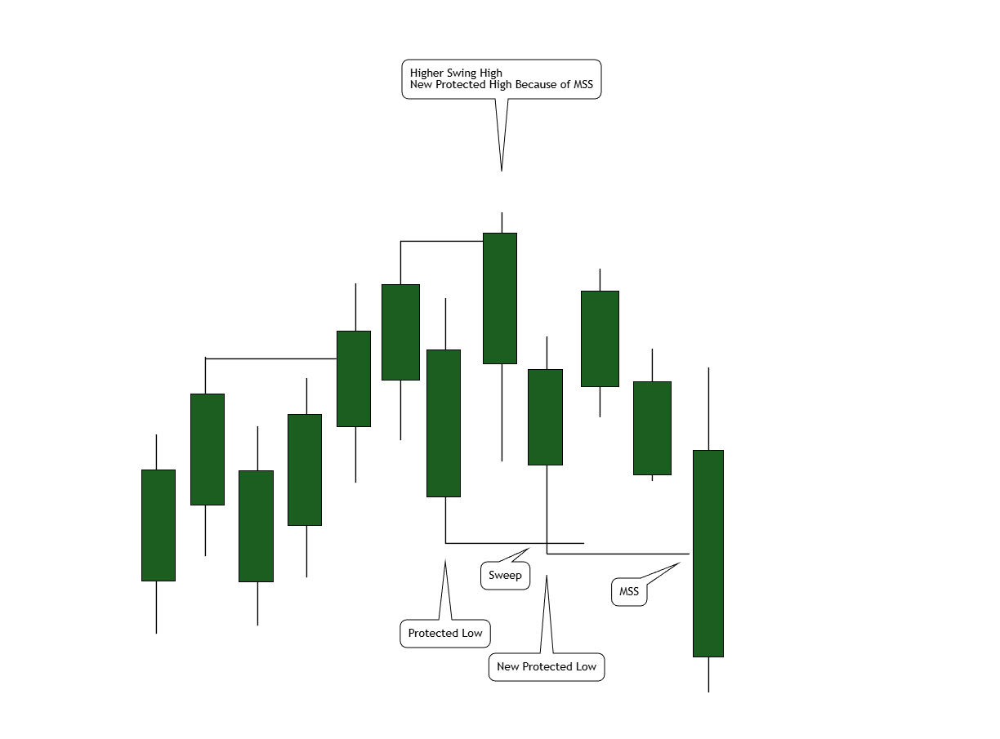
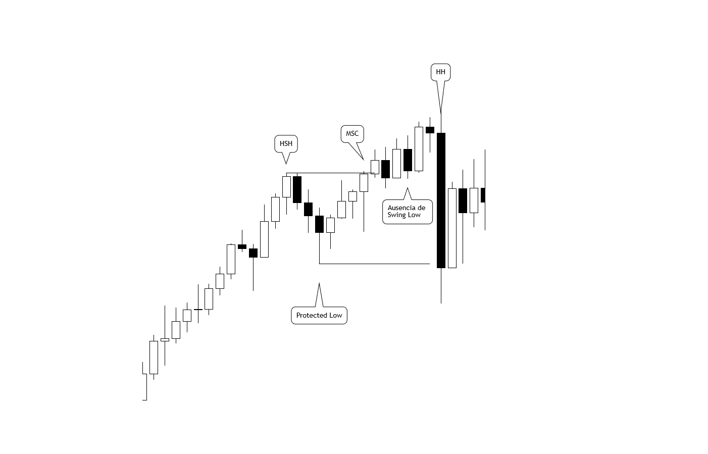
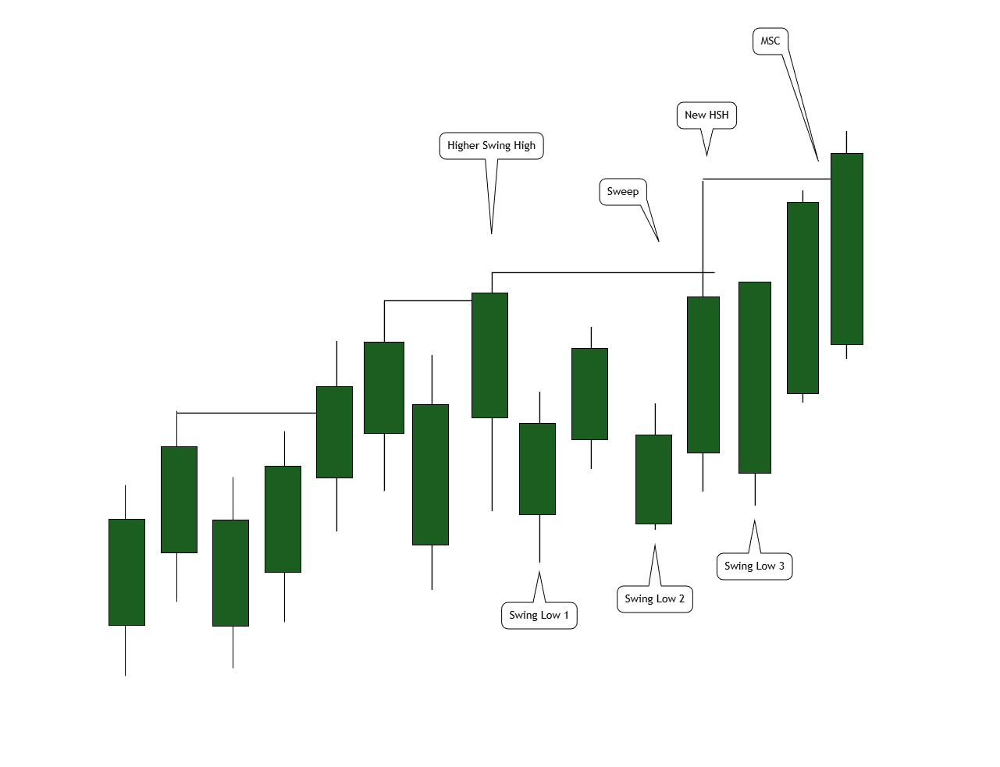
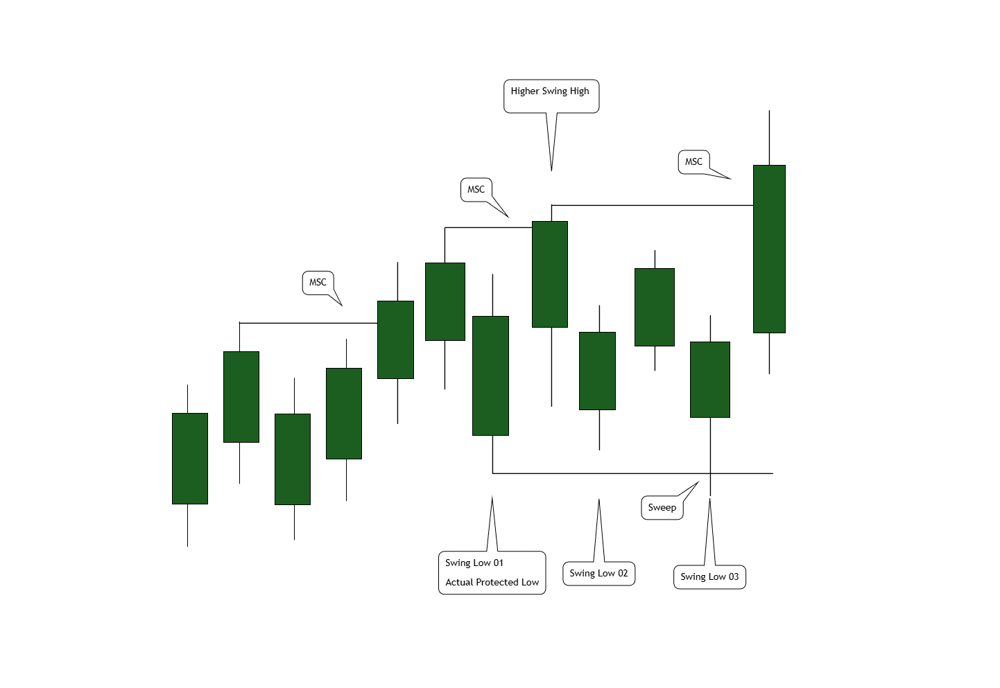

## Estrutura de Mercado

### Swing High

Um *swing high* é uma estrutura mínima de três candles utilizada para identificar um ponto local onde o preço marcou a maior máxima relativa daquela sequência.

### Critérios técnicos
1. **Estrutura mínima**: pelo menos três candles consecutivos.
2. **Candle central dominante**: a máxima do candle central deve ser maior que a máxima do candle imediatamente à esquerda e do candle imediatamente à direita.
3. **Forma da máxima**: a máxima do candle central não precisa vir de um pavio. Se o *close* for o valor mais alto do candle, ele é considerado a máxima. O critério é que o valor máximo do candle central seja superior aos valores máximos dos candles adjacentes.
4. **Máxima compartilhada**: quando duas ou mais candles consecutivas apresentam exatamente a mesma máxima, todas elas podem atuar como swing high, desde que essa máxima compartilhada seja superior à máxima da candle anterior e da candle seguinte.

**Exemplo: Swing High simples**

Na figura `Swing-High.png`:

1. Uma sequência de candles em movimento de alta constrói um topo local.  
2. O candle central apresenta a **maior máxima relativa** em relação aos candles imediatamente anterior e posterior.  
3. Esse candle central é identificado como **swing high válido**, pois respeita todos os critérios de estrutura mínima, dominância e forma da máxima.

**Exemplo: Swing High com máxima compartilhada**

Na figura `Swing-High-Compartilhado.png`:

1. Duas candles consecutivas apresentam **exatamente a mesma máxima absoluta**.  
2. Essa máxima compartilhada é superior às máximas das candles imediatamente anterior e posterior.  
3. Ambas as candles podem ser tratadas como um **swing high compartilhado**, ou como uma **zona de swing high**, já que o mercado aceitou o mesmo patamar de preço como topo relativo antes de iniciar a correção.

---

### Swing Low

Um *swing low* é a estrutura oposta ao swing high e identifica o ponto onde o preço marcou a menor mínima relativa dentro de uma sequência de candles.

### Critérios técnicos
1. **Estrutura mínima**: pelo menos três candles consecutivos.
2. **Candle central dominante**: a mínima do candle central deve ser menor que a mínima do candle imediatamente à esquerda e da mínima do candle imediatamente à direita.
3. **Forma da mínima**: a mínima do candle central não precisa vir de um pavio. Se o *close* for o valor mais baixo do candle, ele é considerado a mínima. O critério é que o valor mínimo do candle central seja inferior aos valores mínimos dos candles adjacentes.
4. **Mínima compartilhada**: quando duas ou mais candles consecutivas apresentam exatamente a mesma mínima, todas elas podem atuar como swing low, desde que essa mínima compartilhada seja inferior à mínima da candle anterior e da candle seguinte.

---

### Regra geral de quebra válida

Todas as quebras estruturais descritas neste documento (BOS, MSS, MSC, sweeps etc.) utilizam a mesma regra básica de “quebra válida”. A diferença entre os conceitos está **no nível que é rompido** e no contexto, não na mecânica da quebra.

#### Quebra de níveis de máxima (high)

Considere um nível de máxima `H` (pode ser um swing high, um HSH ou um *protected high*):

1. **Condição de alcance**  
   - O *high* da candle precisa ser **maior ou igual** a `H`. Se `high < H`, não há quebra.
2. **Participação do corpo**  
   - Seja `Cmax = max(open, close)` da candle. Temos:
     - Se `Cmax > H` → quebra válida do nível `H`.  
     - Se `Cmax = H`, a quebra **só é válida** se `high > H` (existe pavio acima do nível).  
     - Se `Cmax = high = H` → o preço apenas toca o nível; **não há quebra válida**.

Em termos práticos: para aceitar uma quebra com *open* ou *close* igual ao swing high, o candle precisa ter um *high* que ultrapasse esse nível, exibindo pavio acima.

#### Quebra de níveis de mínima (low)

Considere um nível de mínima `L` (pode ser um swing low, um LSL ou um *protected low*):

1. **Condição de alcance**  
   - O *low* da candle precisa ser **menor ou igual** a `L`. Se `low > L`, não há quebra.
2. **Participação do corpo**  
   - Seja `Cmin = min(open, close)` da candle. Temos:
     - Se `Cmin < L` → quebra válida do nível `L`.  
     - Se `Cmin = L`, a quebra **só é válida** se `low < L` (existe pavio abaixo do nível).  
     - Se `Cmin = low = L` → o preço apenas toca o nível; **não há quebra válida**.

Equality (`=`) só é aceita como quebra quando há pavio além do nível, mostrando que o mercado realmente ultrapassou aquele preço, e não apenas encostou.

---

### Break of Swing (BOS)

**BOS (Break of Swing)** é qualquer quebra válida de um swing high ou swing low, conforme a regra anterior. O BOS descreve a evolução da **microestrutura** dentro do contexto de tendência vigente.

#### BOS em alta (BOS de swing high)

Em um movimento de alta:

1. Identifica-se um swing low seguido de um swing high.
2. Após a correção, é formado um novo swing low.
3. Quando uma candle realiza uma quebra válida do swing high anterior, ocorre um **BOS de alta**, produzindo um *higher high (HH)* e confirmando a continuidade da estrutura bullish (sequência HL → HH).

**Exemplo 1 – BOS com corpo acima do HSH**

No cenário ilustrado em `Break-High-1.png`:

1. Um contexto de alta forma um **HSH** claro (máxima estrutural anterior).  
2. O preço corrige, construindo um swing low que dá origem a uma nova perna impulsiva.  
3. A candle final dessa perna tem **high e corpo (open/close) acima do nível do HSH**, atendendo integralmente à regra de quebra válida para máximas.  
4. Essa candle executa um **BOS de swing high**, produzindo um novo *higher high (HH)* e confirmando a continuação da tendência de alta, desde que o swing low que originou a perna permaneça intacto.

**Exemplo 2 – BOS com close igual ao HSH e high acima**

No cenário ilustrado em `Break-High-2.png`:

1. Novamente temos um contexto de alta com um HSH bem definido e um swing low que origina a perna de impulso.  
2. A candle de ruptura apresenta **close exatamente no nível do HSH**, mas o **high ultrapassa esse nível**, gerando pavio acima.  
3. Pela regra geral de quebra válida, como `Cmax = close = HSH` e `high > HSH`, a ruptura é considerada **BOS válido** (não é apenas um toque ou rejeição pontual).  
4. Esse BOS atualiza o swing high para um novo HH, mantendo a leitura estrutural idêntica ao exemplo anterior, com a diferença de que a confirmação se dá via combinação “corpo encostando no nível + pavio acima”.

#### BOS em baixa (BOS de swing low)

Em um movimento de baixa:

1. Identifica-se um swing high seguido de um swing low.
2. Após a correção, é formado um novo swing high.
3. Quando uma candle realiza uma quebra válida do swing low anterior, ocorre um **BOS de baixa**, produzindo um *lower low (LL)* e confirmando a continuidade da estrutura bearish (sequência LH → LL).

Um BOS atualiza a estrutura de swings (HH, HL, LH, LL), mas **nem todo BOS implica mudança de regime**. A mudança efetiva de contexto é tratada principalmente pelo MSS.

---

### Condições iniciais de estrutura

Ao iniciar a leitura de um gráfico (ou de um novo timeframe), é necessário definir primeiro a estrutura básica de swings antes de atribuir qualquer viés ou nível protegido.

1. **Fase apenas de swings**  
   - Enquanto existirem poucos candles, é possível marcar **swing highs** e **swing lows** válidos, mas **não há ainda contexto bullish ou bearish definido**.  
   - Nessa fase inicial, **não existe Protected Low, Protected High, HSH ou LSL**; existem apenas extremos locais de preço.

2. **Primeiro BOS e definição de viés**  
   - O **primeiro BOS válido** é o evento que inicializa a estrutura de tendência:  
     - **BOS de alta** (quebra de swing high) → o contexto passa a ser **bullish**.  
     - **BOS de baixa** (quebra de swing low) → o contexto passa a ser **bearish**.

3. **Inicialização em contexto bullish**  
   - Após um **BOS de alta** válido, com presença de um swing low entre o swing high rompido e a candle de quebra:  
     - o topo resultante do BOS é o primeiro **higher high (HH)** e passa a ser o **HSH estrutural de referência**;  
     - o swing low que originou a perna impulsiva responsável pelo BOS é promovido a **primeiro Protected Low**.

4. **Inicialização em contexto bearish**  
   - Após um **BOS de baixa** válido, com presença de um swing high entre o swing low rompido e a candle de quebra:  
     - o fundo resultante do BOS é o primeiro **lower low (LL)** e passa a ser o **LSL estrutural de referência**;  
     - o swing high que originou a perna impulsiva responsável pelo BOS é promovido a **primeiro Protected High**.

Até que esse primeiro BOS aconteça, qualquer swing high/low deve ser tratado apenas como **candidato estrutural**, e não como nível protegido ou pivô de viés.

---

### Protected Low e Protected High

O conceito de *protected low* e *protected high* está diretamente ligado à estrutura de tendência vigente. Um nível é considerado “protegido” enquanto sua violação implicaria, necessariamente, em uma mudança de regime (MSS).

#### Protected Low (contexto bullish)

Em um contexto bullish válido:

1. **Definição**: o *Protected Low* é o swing low que origina a perna impulsiva responsável pelo *higher swing high* estrutural mais recente (em geral, o swing low mais baixo dentro dessa perna).
2. **Critério estrutural**: esse swing low precisa ter sido seguido por um movimento que resultou em um swing high que executou um BOS de alta, quebrando com corpo de candle o swing high anterior (higher high). Swing lows que não geram um higher high são considerados **internos** e não têm o mesmo peso estrutural.
3. **Condição de proteção**: enquanto nenhuma candle realizar uma quebra válida do Protected Low, o mercado permanece em contexto bullish, mesmo que swing lows intermediários sejam violados.
4. **Perda do Protected Low**: quando uma candle realiza uma quebra válida desse Protected Low, ocorre uma quebra de estrutura de alta, abrindo espaço para a formação de um contexto bearish (MSS bearish).

A figura abaixo ilustra um exemplo de Protected Low em tendência de alta:

#### Protected High (contexto bearish)

Em um contexto bearish válido:

1. **Definição**: o *Protected High* é o swing high que origina a perna impulsiva responsável pelo *lower swing low* estrutural mais recente (em geral, o swing high mais alto dentro dessa perna).
2. **Critério estrutural**: esse swing high precisa ter sido seguido por um movimento que resultou em um swing low que executou um BOS de baixa, quebrando com corpo de candle o swing low anterior (lower low). Swing highs que não geram um lower low são **internos** e não redefinem a estrutura.
3. **Condição de proteção**: enquanto nenhuma candle realizar uma quebra válida do Protected High, o mercado permanece em contexto bearish, mesmo que swing highs intermediários sejam superados.
4. **Perda do Protected High**: quando uma candle realiza uma quebra válida desse Protected High, ocorre uma quebra de estrutura de baixa, abrindo espaço para a formação de um contexto bullish (MSS bullish).

---

### Atualização dos níveis protegidos (promoção)

Os níveis protegidos não são fixos; eles são atualizados conforme a tendência evolui e novas pernas impulsivas estruturais são formadas.

#### Atualização do Protected Low em contexto bullish

Em uma tendência de alta válida:

1. Identifica-se um *higher swing high* que realizou um BOS de alta sobre o swing high anterior.
2. Considera-se a perna impulsiva de alta que levou a esse higher swing high. O swing low **mais baixo dessa perna**, que deu origem ao movimento, passa a ser o **Protected Low** atual.
3. Enquanto a estrutura seguir em alta, a formação de um novo higher swing high estrutural, resultante de outra perna impulsiva, promove o swing low que origina essa nova perna a **novo Protected Low**, substituindo o anterior como referência principal.
4. O Protected Low antigo continua existindo historicamente, mas o nível considerado para mudança de regime passa a ser sempre o Protected Low **mais recente**.
5. **Sweep em Protected Low**: se, durante uma correção, ocorrer um *sweep* abaixo do Protected Low (pavio rompe o nível, mas o corpo da candle fecha acima dele, sem quebra válida), o **novo low extremo desse pavio passa a ser o novo Protected Low**. Nesse caso, o HSH estrutural permanece o mesmo; apenas o nível de proteção é refinado para baixo.

#### Atualização do Protected High em contexto bearish

Em uma tendência de baixa válida, o raciocínio é espelhado:

1. Cada *lower swing low* formado por um BOS de baixa decorre de uma perna impulsiva de queda.
2. O swing high **mais alto dessa perna**, que deu origem ao movimento, passa a ser o **Protected High** atual.
3. Quando surge um novo *lower swing low* estrutural em uma nova perna, o swing high que origina essa nova perna é promovido a **novo Protected High**, substituindo o anterior como referência principal.
4. Um evento de mudança de regime ocorrerá quando esse Protected High mais recente for quebrado de forma válida (MSS bullish).
5. **Sweep em Protected High**: se, durante uma correção, ocorrer um *sweep* acima do Protected High (pavio rompe o nível, mas o corpo da candle fecha abaixo dele, sem quebra válida), o **novo high extremo desse pavio passa a ser o novo Protected High**. Nesse caso, o LSL estrutural permanece o mesmo; apenas o nível que precisa ser quebrado para um eventual MSS bullish é refinado para cima.

De forma resumida: a cada novo HH (em alta) ou LL (em baixa) que seja resultado de um BOS estrutural, o extremo oposto que origina a perna impulsiva correspondente é promovido a nível protegido mais recente; e sweeps sobre esses níveis protegidos podem **ajustar o valor exato do Protected Low/High**, sem alterar o HSH/LSL nem, por si só, gerar MSS.

---

### Market Structure Shift (MSS)

**MSS (Market Structure Shift)** é a quebra válida de um nível protegido (*protected low* ou *protected high*) que altera o contexto de tendência principal.

#### Exemplo visual de MSS

Na figura `MSS.png` é ilustrado o conceito básico de mudança de estrutura:

1. O mercado encontra-se em **tendência de alta**, com um swing high importante e o **swing low que deu origem à perna impulsiva** marcado como nível de referência.  
2. Enquanto os preços corrigem acima desse swing low, a estrutura permanece bullish (apenas retração dentro da perna de alta).  
3. Em determinado momento, forma-se uma candle cujo **corpo fecha abaixo desse swing low de referência**, respeitando a regra de quebra válida para mínimas.  
4. Essa quebra transforma o swing low em nível violado e caracteriza um **MSS bearish**: a sequência de HH/HL é interrompida e o contexto passa a ser de baixa, com o topo imediatamente anterior sendo promovido a nível de resistência estrutural (Protected High, conforme definido nas seções seguintes.

#### MSS de alta para baixa

1. O mercado encontra-se em contexto bullish, com um Protected Low definido (que pode ter sido refinado por sweeps).
2. Uma candle realiza uma quebra válida desse Protected Low mais recente, segundo as regras de mínima (low).
3. Esse evento é um **MSS bearish**, indicando transição de estrutura de alta para estrutura de baixa e invalidação da tendência bullish anterior.
4. O **Protected High** inicial do novo contexto bearish passa a ser a **máxima da última perna impulsiva de alta que antecede o MSS** (o topo da estrutura anterior), independentemente de essa máxima ter sido marcada por um HSH clássico ou apenas por um HH sem formação posterior de swing low.

#### Exemplo: sweep em Protected Low seguido de MSS

No exemplo ilustrado em `Protected-Low-Sweep-Update.png`:

1. O mercado está em contexto bullish, com um **Protected Low** definido e um **Higher Swing High (HSH)** estrutural.
2. Forma-se uma candle que realiza um **sweep abaixo do Protected Low**: o *low* perfura o nível (`low < Protected Low`), mas o corpo fecha acima (`min(open, close) > Protected Low`).  
   - Não há MSS; o **novo extremo de pavio passa a ser o novo Protected Low**, e o HSH estrutural permanece o mesmo.
3. Após o sweep, o preço não consegue continuar a alta. Em seguida, uma nova candle **quebra com corpo esse novo Protected Low**, respeitando a regra de quebra válida para níveis de mínima.
4. Essa quebra caracteriza um **MSS bearish**: o contexto deixa de ser bullish e passa a ser bearish.
5. O **topo da última perna impulsiva de alta antes do MSS** (o HH/HSH imediatamente anterior) é promovido a **Protected High** do novo contexto bearish, servindo como nível cuja quebra futura sinalizaria um MSS bullish.

#### Exemplo: HH terminal como Protected High após MSS

No exemplo ilustrado em `HH-As-Protected-High.png`:

1. O mercado está em tendência de alta, com um **HSH** e um **Protected Low** previamente definidos.
2. Após uma correção, ocorre um **MSC bullish** que gera uma nova perna impulsiva de alta. Essa perna rompe o HSH anterior e marca um **higher high (HH)** final, que é a máxima da perna, mesmo sem haver formação posterior de swing low.
3. Em seguida, o preço reverte de forma agressiva e ocorre um **MSS bearish**, com uma candle quebrando com o corpo o Protected Low vigente.
4. De acordo com a definição geral, o **Protected High inicial do novo contexto bearish** passa a ser justamente esse **HH terminal**, pois ele representa a máxima da última perna impulsiva de alta que antecede o MSS, independentemente de ter sido ou não consolidado como um HSH clássico.

#### MSS em candle única (HH/HSH como Protected High)

Em alguns casos, a própria candle que marca a máxima da perna de alta também é a candle que executa o MSS para baixo. Essa situação é um caso particular da regra geral:

- A **candle é HH/HSH** porque realiza um BOS de alta acima do último HSH, atendendo integralmente à regra de quebra válida para máximas; e
- na mesma formação, o **corpo da candle quebra o Protected Low vigente**, atendendo à regra de quebra válida para mínimas.

Tecnicamente:

1. A máxima dessa candle é a **máxima da última perna impulsiva de alta que antecede o MSS** (a perna é “condensada” em uma única barra).
2. A mínima e/ou o corpo da mesma candle realizam a quebra válida do **Protected Low**.
3. O evento é classificado como **MSS bearish**, pois o nível protegido foi perdido.
4. O **Protected High inicial** do novo contexto bearish é o próprio **high dessa candle**, já que ele é, simultaneamente:
   - o topo da perna que originou a reversão; e
   - o nível estrutural cuja perda futura caracterizará um eventual MSS bullish.

No exemplo ilustrado em `Single-Candle-MSS.png`:

1. O mercado está em tendência de alta, com um **HSH** bem definido, um **Protected Low** e um **MSC bullish** que confirmam a estrutura de alta.
2. A perna final de alta culmina em uma única candle forte que:
   - rompe o HSH anterior, configurando um **HH válido** (BOS de alta); e
   - na mesma barra, estende-se para baixo e **fecha abaixo do Protected Low**, realizando a quebra válida do nível protegido.
3. Essa única candle representa, ao mesmo tempo, o **HH estrutural** e a **candle do MSS bearish**.
4. Pelo critério da última perna impulsiva, o **high dessa candle** passa a ser o **Protected High do novo contexto bearish**, mesmo sem ter havido formação posterior de swing low.

> Versão espelhada (MSS bullish)  
> Em contexto bearish, a mesma lógica se aplica de forma simétrica:  
> - uma única candle pode marcar o **LL/LSL** (mínima da última perna impulsiva de baixa) e, ao mesmo tempo, executar o **MSS bullish** ao quebrar com o corpo o Protected High vigente;  
> - nesse caso, o **Protected Low inicial** do novo contexto bullish passa a ser o **low dessa candle**, que passa a representar o fundo estrutural cuja perda futura caracterizará um novo MSS bearish.

#### MSS de baixa para alta

1. O mercado encontra-se em contexto bearish, com um Protected High definido (que pode ter sido refinado por sweeps).
2. Uma candle realiza uma quebra válida desse Protected High mais recente, segundo as regras de máxima (high).
3. Esse evento é um **MSS bullish**, indicando transição de estrutura de baixa para estrutura de alta.
4. O **Protected Low** inicial do novo contexto bullish passa a ser a **mínima da última perna impulsiva de baixa que antecede o MSS** (o fundo da estrutura anterior), independentemente de essa mínima ter sido marcada por um LSL clássico ou apenas por um LL sem formação posterior de swing high.

Todo MSS é, por definição, um BOS em um nível especial (protegido), mas **nem todo BOS é um MSS**.

---

### Notação HSH e LSL

Para facilitar a leitura da estrutura, utilizamos as seguintes abreviações:

- **HSH (Higher Swing High)**: o swing high que representa a **máxima estrutural mais recente** em um contexto bullish. Por padrão, é o swing high resultante de um BOS de alta (um HH relevante). Em situações de *sweep* de continuação, o *high* máximo do pavio que ultrapassa o HSH anterior passa a ser tratado como **novo HSH de referência**, mesmo sem BOS.
- **LSL (Lower Swing Low)**: o swing low que representa a **mínima estrutural mais recente** em um contexto bearish. Por padrão, é o swing low resultante de um BOS de baixa (um LL relevante). Em situações de *sweep* de continuação, o *low* mínimo do pavio que ultrapassa o LSL anterior passa a ser o **novo LSL de referência**, mesmo sem BOS.

HSH e LSL são, portanto, os níveis de extrema relevância sobre os quais ocorrem sweeps, MSC e MSS.

---

### Sweep

Um *sweep* é um evento em que o preço **ultrapassa um nível estrutural apenas com o pavio**, sem produzir uma quebra válida segundo a regra de BOS.

Existem dois contextos principais de sweep:
- **Sweep de estrutura (HSH/LSL)**: atua sobre o extremo da tendência (HSH ou LSL), normalmente em movimentos de continuação.
- **Sweep de nível protegido (Protected Low/High)**: atua sobre o nível que define o regime (protected low/high), normalmente em movimentos que antecedem um possível MSS.

#### Sweep de estrutura em contexto bullish (HSH)

Considere um contexto bullish com um **HSH** e um **Protected Low** já definidos:

1. Forma-se uma candle cujo *high* é **maior que o HSH**, porém `max(open, close) < HSH`.  
2. Pela regra de quebra válida, **não há BOS**, pois o corpo da candle não participa da ruptura do nível; somente o pavio excede o HSH.  
3. Esse movimento caracteriza um **sweep de liquidez acima do HSH**: o mercado testa preços além da máxima, rejeita o nível e fecha novamente abaixo dele.

Efeitos estruturais do sweep de estrutura:

- O **Protected Low permanece inalterado**: não há violação do nível protegido, nem MSS.  
- O *high* máximo atingido pelo pavio passa a ser o **novo HSH de referência**.  
- **Múltiplos sweeps consecutivos** podem ocorrer: cada novo pavio que ultrapassa o HSH anterior apenas **atualiza o HSH** para esse novo extremo, sem alterar o Protected Low e sem caracterizar BOS, MSS ou MSC.

#### Sweep de estrutura em contexto bearish (LSL)

O caso bearish é o espelho:

1. Em uma tendência de baixa com um **LSL** e um **Protected High** definidos, forma-se uma candle cujo *low* é **menor que o LSL**, mas `min(open, close) > LSL`.  
2. Não há BOS de baixa (o corpo não rompe o LSL), apenas pavio abaixo do nível.  
3. O **low mínimo do pavio** passa a ser o **novo LSL de referência**, enquanto o Protected High permanece inalterado.

#### Sweep em nível protegido (Protected Low/High)

Além dos sweeps em HSH/LSL, também podem ocorrer sweeps diretamente sobre o nível protegido:

- **Bullish**: uma candle cujo *low* perfura o Protected Low com o pavio (`low < Protected Low`), mas `min(open, close) > Protected Low`.  
  - Não há MSS (corpo não quebra o nível), porém o **novo low extremo do pavio passa a ser o novo Protected Low**.  
  - O **HSH estrutural permanece o mesmo**; o que muda é apenas o valor exato do nível que precisa ser quebrado para que o MSS bearish seja formalizado.

- **Bearish**: uma candle cujo *high* perfura o Protected High com o pavio (`high > Protected High`), mas `max(open, close) < Protected High`.  
  - Não há MSS, porém o **novo high extremo do pavio passa a ser o novo Protected High**.  
  - O **LSL estrutural permanece o mesmo**; apenas o nível que precisa ser quebrado para um eventual MSS bullish é refinado para cima.

Sweeps em níveis protegidos, portanto, **ajustam o ponto exato de invalidade da tendência**, mas não mudam o regime nem os extremos estruturais (HSH/LSL) por si só.

---

### Market Structure Continuation (MSC)

**MSC (Market Structure Continuation)** é o evento que confirma a **continuação da tendência vigente**, por meio de um BOS estrutural, **sem violar o nível protegido oposto**.

#### MSC em contexto bullish

Em um contexto bullish com Protected Low e HSH definidos (podendo o HSH ter sido atualizado por sweeps de estrutura e o Protected Low refinado por sweeps de nível protegido):

1. O preço realiza uma correção e, a partir de um swing low, inicia uma nova **perna impulsiva de alta**.  
2. A candle final dessa perna executa um **BOS válido acima do HSH mais recente**, respeitando a regra de quebra (high alcançando o nível e corpo participando da ruptura).  
3. Como o **Protected Low não foi quebrado** em nenhum momento antes desse BOS, o evento é classificado como **MSC bullish**: confirmação de continuação da estrutura de alta.

Atualização estrutural no MSC bullish:

- O swing low que passa a ser o **novo Protected Low** é o **swing low mais baixo que origina a perna impulsiva** responsável pelo BOS acima do HSH (isto é, o swing low que “dispara” o movimento do MSC).  
- Swings lows formados dentro dessa mesma perna, mas em níveis mais altos, são considerados **swings internos** e não assumem o papel de Protected Low.  
- Se não houver nenhum swing low novo abaixo do Protected Low anterior durante essa perna, o **Protected Low permanece o mesmo** após o MSC; apenas o HSH é atualizado.

#### MSC em contexto bearish

Em uma tendência de baixa com Protected High e LSL definidos:

1. O preço realiza uma correção e, a partir de um swing high, inicia uma nova **perna impulsiva de baixa**.  
2. A candle final dessa perna executa um **BOS válido abaixo do LSL mais recente**, sem que o Protected High tenha sido rompido.  
3. Esse evento é um **MSC bearish**, confirmando a continuação da estrutura de baixa.

Atualização estrutural no MSC bearish:

- O swing high que passa a ser o **novo Protected High** é o **swing high mais alto que origina a perna impulsiva** responsável pelo BOS abaixo do LSL.  
- Swings highs internos, formados abaixo desse nível dentro da mesma perna, não promovem atualização do Protected High.  
- Se não houver swing high novo acima do Protected High anterior durante essa perna, o **Protected High permanece o mesmo** após o MSC; apenas o LSL é atualizado.

A figura abaixo (`Sweep+MSC.png`) exemplifica um contexto bullish com HSH, sweep de estrutura, atualização de HSH e posterior MSC, além dos swings lows numerados que ajudam a identificar qual low passa a ser o Protected Low após a continuação:

#### Exemplo: sweep em Protected Low com continuação (MSC)

No exemplo ilustrado em `Protected-Low-Sweep-Update-2.png`:

1. O **Swing Low 01** é o Protected Low vigente, pois originou a perna impulsiva do Higher Swing High anterior.
2. O **Swing Low 02** forma-se acima do Protected Low e não gera novo higher high estrutural, sendo classificado como **swing interno**.
3. O **Swing Low 03** realiza um **sweep abaixo do Protected Low 01**, mas o corpo da candle fecha acima desse nível, atualizando o valor do **Protected Low** para o extremo do pavio.
4. A partir do Swing Low 03 nasce uma nova perna impulsiva que executa o **MSC** (BOS acima do HSH), confirmando a continuação bullish com o Swing Low 03 atuando como Protected Low mais recente.

---

### Identificação de mercado bullish e bearish

Com os conceitos de swing, BOS, níveis protegidos, MSS, MSC, HSH/LSL e sweeps, a leitura de contexto pode ser resumida da seguinte forma:

#### Mercado bullish

O mercado é considerado **bullish** quando:

1. Existe uma sequência de BOS de alta formando *higher highs (HH)* e *higher lows (HL)*; e
2. O Protected Low mais recente (eventualmente refinado por sweeps) ainda não foi perdido (não houve MSS bearish).

Operacionalmente:
- Identifica-se o swing low que origina a perna impulsiva responsável pelo higher swing high estrutural mais recente.  
- Esse swing low é marcado como Protected Low.  
- Enquanto não houver quebra válida desse Protected Low, os movimentos contrários são classificados como correções dentro da tendência de alta.  
- MSCs sucessivos atualizam HSH e, quando houver novo low de origem da perna, também podem atualizar o Protected Low; sweeps de estrutura apenas refinam o HSH, e sweeps em nível protegido apenas refinam o valor do Protected Low.

#### Mercado bearish

O mercado é considerado **bearish** quando:

1. Existe uma sequência de BOS de baixa formando *lower lows (LL)* e *lower highs (LH)*; e
2. O Protected High mais recente (eventualmente refinado por sweeps) ainda não foi perdido (não houve MSS bullish).

Operacionalmente:
- Identifica-se o swing high que origina a perna impulsiva responsável pelo lower swing low estrutural mais recente.  
- Esse swing high é marcado como Protected High.  
- Enquanto não houver quebra válida desse Protected High, os movimentos de alta são classificados como correções dentro da tendência de baixa.  
- MSCs sucessivos atualizam LSL e, quando houver novo high de origem da perna, também podem atualizar o Protected High; sweeps de estrutura refinam o LSL e sweeps em nível protegido refinam o valor do Protected High.
